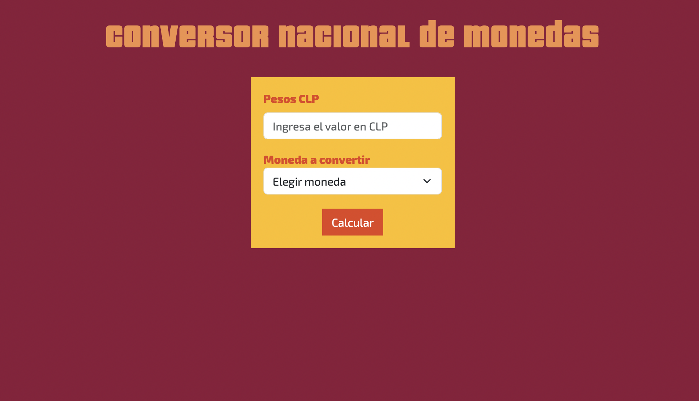

# Módulo 3 - Introducción a la programación con JavaScript - Desafio 6 - Conversor de Monedas

Este desafio se trata de creación de sistema de conversión de monedas por medio de Consumo de APIs, Promesas, Async, Await, Manejo de errores y demás conceptos vistos.

